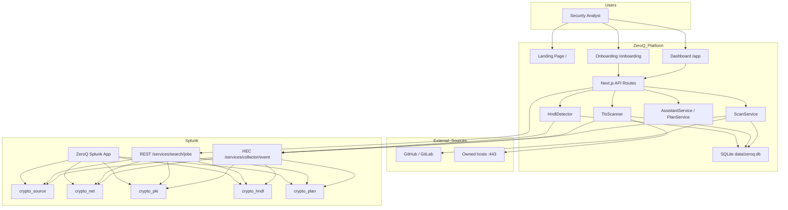

# ZeroQ Architecture Diagram

ZeroQ is a Next.js 14 application that discovers quantum-vulnerable cryptography across **source code** and **network infrastructure**, then reasons over the findings with an AI agent backed by Splunk data.

## High-level flow



## Component layout

```
app/
├── page.tsx              # Landing page
├── app/                  # Dashboard (Risk, Inventory, Certs, HNDL, etc.)
├── onboarding/           # Guided Splunk + GitHub setup wizard
└── api/                  # Thin controllers → services

lib/
├── config.ts             # Typed env + SQLite settings
├── rules.ts              # 18 quantum-vulnerable crypto rules
├── scanning/             # detector · scoring · target parser
├── providers/            # GitHubProvider · GitLabProvider
├── ai/                   # DeepSeekProvider · LocalReasoner
├── splunk/               # HecSplunkClient · SplunkSearchClient
├── services/             # Scan · Assistant · Plan · TLS · HNDL
├── db/                   # SQLite connection + settings
└── types.ts              # Shared TypeScript contracts

data/
└── zeroq.db              # Local SQLite store (scans, TLS, certs, HNDL)

zeroq-splunk-app/
├── default/indexes.conf       # crypto_* indexes
├── default/props.conf         # sourcetypes & JSON extractions
├── default/savedsearches.conf # alerts
├── default/data/ui/views/     # dashboards
└── lookups/                   # compliance mapping
```

## Data flow

1. **Configure** — Settings are stored in SQLite first; `config.ts` reads SQLite, then `process.env`, then defaults.
2. **Ingest code** — `ScanService` pulls repo trees + blobs from GitHub/GitLab and runs the 18-rule detector.
3. **Ingest network** — `TlsScanner` connects to owned hosts on port 443 and stores TLS/certificate metadata.
4. **Persist** — Every scan is saved to SQLite. When Splunk is enabled, the same events are pushed via HEC in parallel.
5. **Index** — Splunk indexes are defined in `zeroq-splunk-app/default/indexes.conf`; sourcetypes and field extractions are in `props.conf`.
6. **Read** — Dashboard APIs prefer live Splunk REST results; if Splunk is empty or offline, `LocalDataClient` serves the same shape from SQLite.
7. **Detect HNDL** — `HndlDetector` builds Harvest-Now-Decrypt-Later anomaly signals from TLS scan data (or reads them from `crypto_hndl` when Splunk is connected).
8. **Reason** — `AssistantService` builds a posture context from live data; `PlanService` generates a ranked migration plan.
9. **Alert** — Saved searches in `savedsearches.conf` trigger on critical findings, expiring certs and HNDL anomalies.
10. **Visualize** — Next.js dashboards (`/app`) and the native Splunk app (`zeroq-splunk-app`) render the same data.

## Deployment

```bash
npm install
cd zeroq-splunk-app && tar -czvf ../zeroq-splunk-app.spl .
# Upload zeroq-splunk-app.spl to Splunk → Apps → Manage Apps → Install app from file
npm run dev   # http://localhost:3000
```

See [README.md](./README.md) for full setup instructions.
